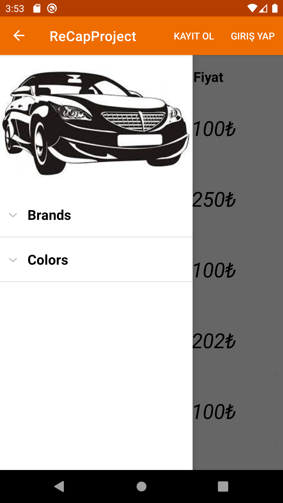
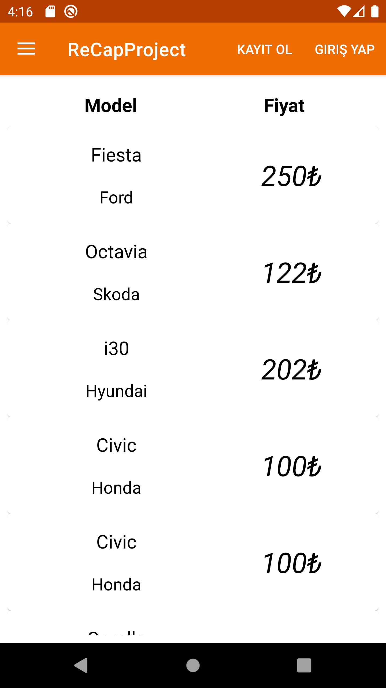
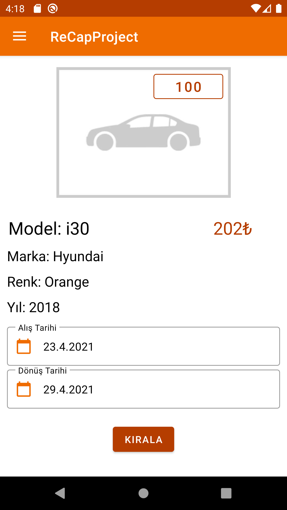
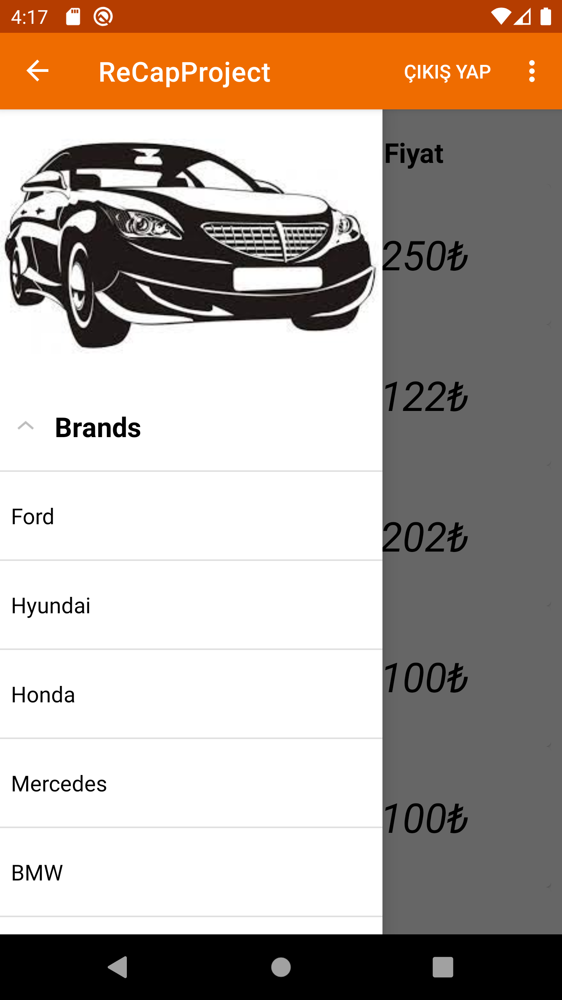
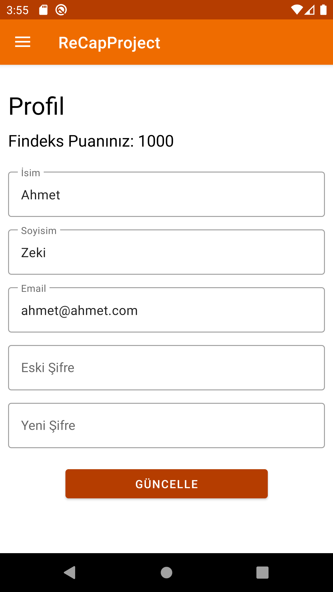
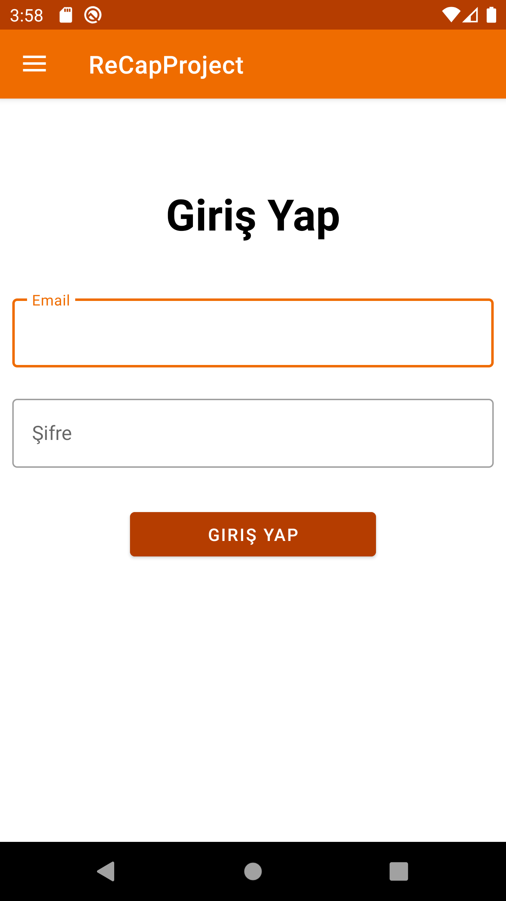
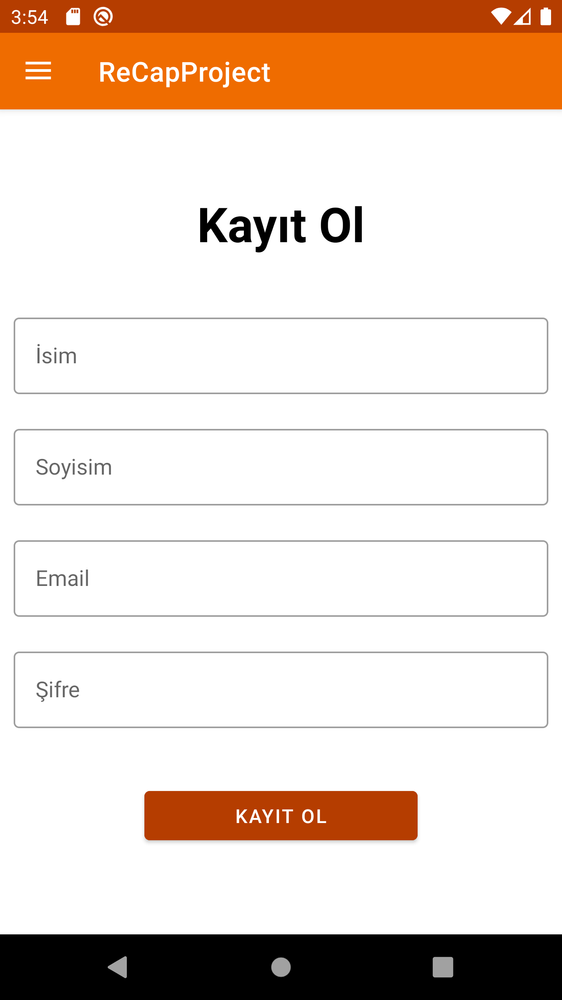
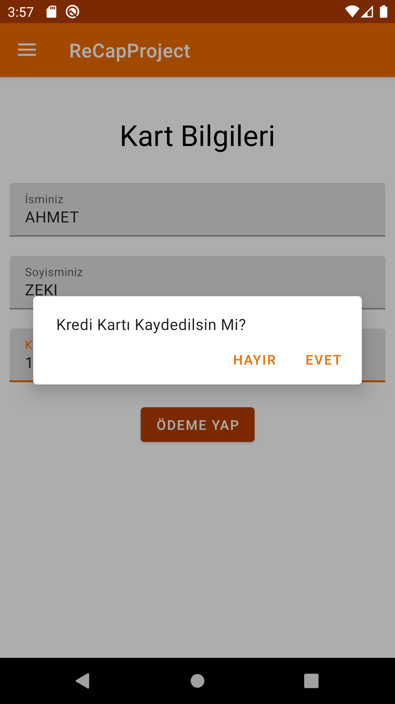

# ReCapProjectAndroid-Mobile-
This project is mobile version of [ReCapProject-Backend](https://github.com/VonHumbolt/ReCapProject). This project use these technologies:
- **Kotlin**
- **Retrofit**
- **Android ViewModels**
- **Android Navigation Components**
- **Mssql**

## Summary Of Project
  This is a car rental project that receives data from web service using with Retrofit. Project lists cars using RecyclerView. Person who uses this app can list cars by filtering their
brands and colors. Person can easily go to detail page of car by clicking on the card of car and rent this car on this page. Also, user can create an account with email.

## Layers of Project

### Adapters
Contains RecyclerView Adapter and ExpandableList Adapter for listing their items. 

### Api
Instance of Retrofit Library and Api class which contains api requests for receive data from internet.

### Constants
Constant of Project such as base url.

### Fragments
All project fragments for interacting with users.

### Models
Data Classes which are hold the data from api requests.

### Repository
Repository Class for managing the ViewModel functions.

### ViewModels
Contains ViewModel class for observing data and preventing the lose data from rotate device changes ; ViewModelFactory class which is required for ViewModel Class.

## Screenshots of App
 | 
 |
 |
 |

